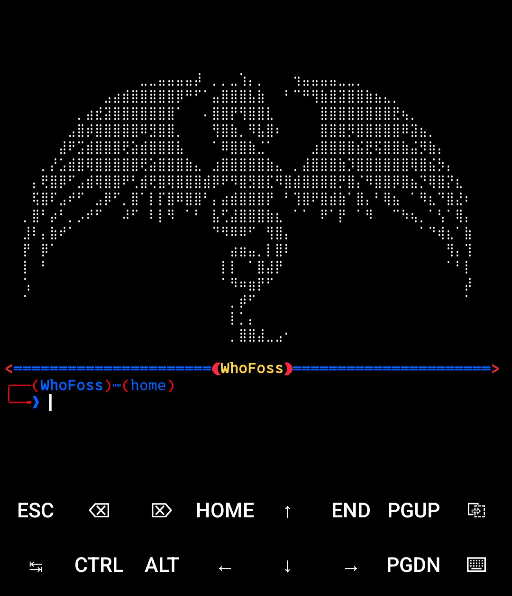

### Ok. Admita, ficou top ksksksksks


---

### termux-preset
```bash
bash -c "$(curl -fsSL https://raw.githubusercontent.com/WhoFoss/termux-preset/refs/heads/main/preset.sh)"
```
### Dependências (Opcional)
```bash
bash -c "$(curl -fsSL https://raw.githubusercontent.com/WhoFoss/termux-preset/refs/heads/main/deps.sh)"
```
> Minha preset que uso no Termux. É básica, então não espere muita coisa.
